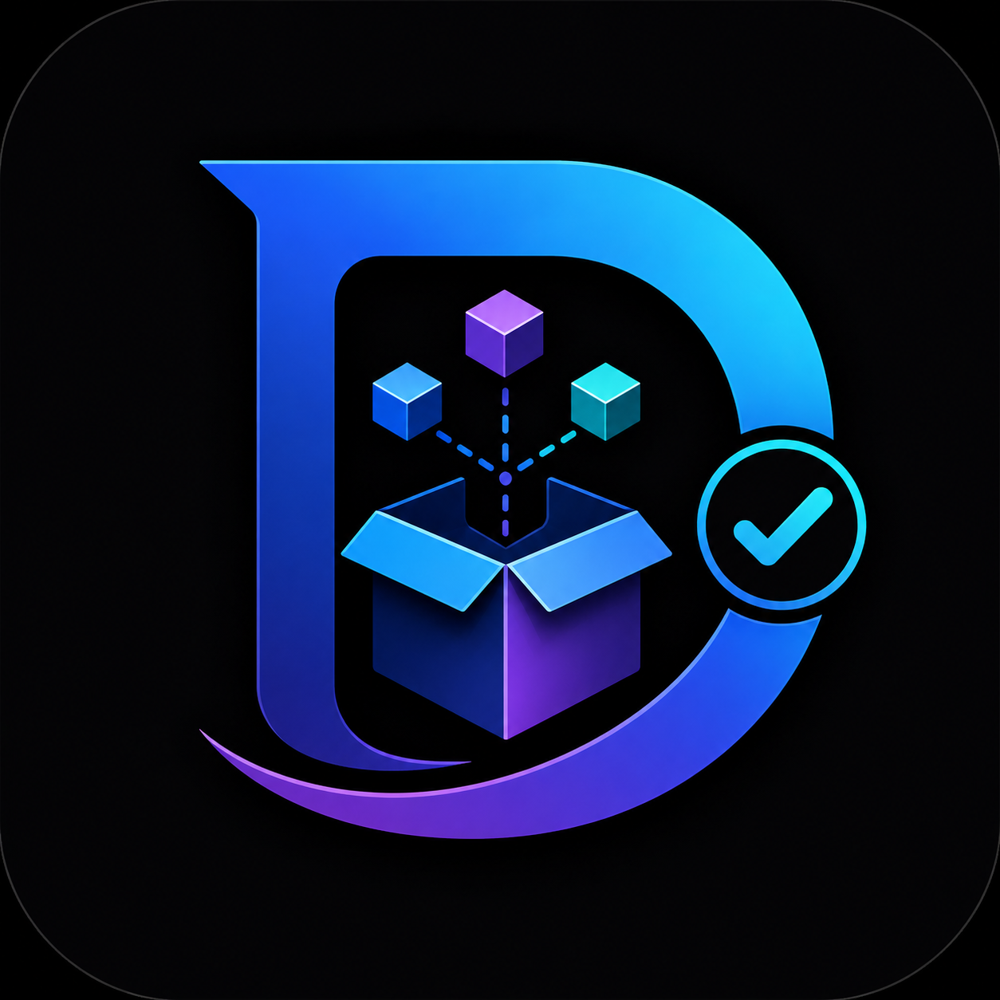

<p align="center">
  
</p>

# Dependify (Smart Dependency Assistant)

A production-ready VS Code extension that helps developers quickly identify and resolve dependency-related issues while coding.


## Features

🎯 **Smart Dependency Detection**
- Automatically monitors terminal output for dependency-related errors
- Detects missing packages, version conflicts, and environment issues
- Supports Python and Node.js projects

📦 **Beginner-Friendly Explanations**
- Converts technical error messages into simple, understandable language
- Explains what went wrong and why
- Provides context-aware solutions

🚀 **One-Click Installation**
- Generates correct installation commands for detected packages
- Provides copy-to-clipboard functionality
- Optional one-click installation with safety checks
- Shows alternative installation methods

🎨 **Beautiful UI**
- Clean, modern webview panel in VS Code
- Dark mode support
- Real-time status updates
- Confidence indicators for detection accuracy

## Supported Errors

### Python
- `ModuleNotFoundError: No module named 'package'`
- `ImportError: No module named 'package'`
- `cannot import name 'module'`
- Version conflicts and environment issues

### Node.js
- `Cannot find module 'package'`
- `MODULE_NOT_FOUND`
- `npm ERR! 404` (package not found)
- `ERESOLVE` (dependency conflicts)

## Installation

1. Open VS Code
2. Go to Extensions (Ctrl+Shift+X / Cmd+Shift+X)
3. Search for "Smart Dependency Assistant"
4. Click Install

## How to Use

### Basic Usage

1. **Run your code** - Execute your Python script or Node.js application in the terminal
2. **Get notified** - When a dependency error occurs, the extension detects it
3. **Review the issue** - The Smart Dependency Panel explains what's wrong
4. **Install the package** - Click "Install Package" or copy the command manually

### Manual Check

If you want to manually check your terminal output:
1. Press `Ctrl+Shift+P` (or `Cmd+Shift+P` on Mac)
2. Type "Smart Dependency Assistant: Check Terminal"
3. The extension will analyze the current terminal output

## Project Structure

```
src/
├── extension.ts              # Main entry point
├── analyzer/
│   ├── errorAnalyzer.ts     # Error detection and analysis
│   ├── languageDetector.ts  # Detects project language
│   └── dependencyParser.ts  # Parses dependency files
├── commands/
│   ├── installCommandGenerator.ts  # Generates install commands
│   └── commandRegistry.ts          # Registers VS Code commands
├── terminal/
│   └── terminalMonitor.ts   # Monitors terminal output
├── ui/
│   ├── webviewProvider.ts   # Webview UI panel
│   └── notificationManager.ts # Handle notifications
├── types/
│   └── types.ts             # TypeScript type definitions
└── utils/
    └── helpers.ts           # Utility functions
```

## Development

### Prerequisites

- Node.js 18+
- npm or yarn
- VS Code 1.85+
- TypeScript 5.3+

### Setup

```bash
# Clone or create project
cd smart-dependency-assistant

# Install dependencies
npm install

# Compile TypeScript
npm run compile

# Watch mode (for development)
npm run watch
```

### Build and Package

```bash
# Compile with optimizations
npm run vscode:prepublish

# Create VSIX package for distribution
npx vsce package
```

### Running Locally

1. Open the project in VS Code
2. Press `F5` to start debugging
3. A new VS Code window will open with the extension loaded
4. Test by running Python or Node.js commands that trigger dependency errors

### Running Tests

```bash
# Run test suite
npm test

# Run with coverage
npm test -- --coverage
```

## Configuration

The extension works out-of-the-box with no configuration needed. However, you can customize behavior with VS Code settings:

```json
{
  "smartDependencyAssistant.autoInstall": false,
  "smartDependencyAssistant.showNotifications": true,
  "smartDependencyAssistant.confidenceThreshold": 60,
  "smartDependencyAssistant.languages": ["python", "nodejs"]
}
```

## How It Works

### Architecture

1. **Terminal Monitoring** - Listens to terminal output for error patterns
2. **Language Detection** - Identifies project type (Python/Node.js)
3. **Error Analysis** - Uses regex patterns to detect dependency issues
4. **Package Extraction** - Extracts package name from error message
5. **Command Generation** - Generates appropriate install commands
6. **UI Display** - Shows issues in a beautiful webview panel
7. **Safe Installation** - Executes commands with safety validation

### Error Detection Flow

```
Terminal Output
    ↓
[Terminal Monitor]
    ↓
[Error Analyzer] → Pattern Matching
    ↓
[Language Detector] → Language Detection
    ↓
[Dependency Parser] → Check if package exists
    ↓
[Issue Created] → Confidence Scoring
    ↓
[Webview Display] → Show UI Panel
    ↓
[Command Generator] → Generate install command
    ↓
[User Action] → Install or Copy Command
```

## Type System

The extension uses strict TypeScript typing for reliability:

```typescript
// Core types (see types/types.ts)
- SupportedLanguage enum (Python, NodeJS)
- IssueType enum (Missing, Conflict, Environment, NonDependency)
- DependencyIssue interface
- InstallCommand interface
- AnalysisResult interface
```

## Safety

The extension implements multiple safety layers:

✅ **Pattern Matching Only** - Doesn't execute unknown commands  
✅ **Command Validation** - Checks for injection attempts  
✅ **Confidence Scoring** - Only acts on high-confidence detections  
✅ **User Approval** - Requires explicit approval before installation  
✅ **Terminal Execution** - Runs commands visibly in user's terminal  

## Limitations

- Requires terminal output to contain error message (doesn't intercept VS Code's run output yet)
- Supports Python and Node.js (other languages in roadmap)
- Confidence scoring based on pattern matching (not AST analysis)
- Limited to common error patterns

## Troubleshooting

### Extension not detecting errors?

1. Make sure error is printed to terminal
2. Check that error message matches known patterns
3. Open Command Palette and run "Smart Dependency Assistant: Check Terminal"
4. Enable debug logs: `"smartDependencyAssistant.debug": true`

### Installation not working?

1. Verify package name is correct
2. Check you have internet connection
3. Try copying command and running manually
4. Check pip/npm installation locally

### Panel not showing?

1. Click on "Smart Dependency Panel" in the Activity Bar
2. Press `Ctrl+Shift+P` and search "Smart Dependency Assistant"
3. Reload VS Code window (F1 → Developer: Reload Window)

## Contributing

Contributions welcome! Please:

1. Fork the repository
2. Create a feature branch
3. Make your changes
4. Run tests: `npm test`
5. Submit a pull request

### Adding Support for New Languages

1. Add language to `SupportedLanguage` enum in `types/types.ts`
2. Add error patterns to `errorAnalyzer.ts`
3. Add install command logic to `installCommandGenerator.ts`
4. Update documentation

## Performance

- **Memory**: ~15-20MB base + dependencies
- **CPU**: Minimal impact (only analyzes terminal output when changed)
- **Startup**: <1 second extension activation

## License

MIT © 2024 Suravi R

## Support

- 📖 [Full Documentation](./docs)
- 🐛 [Report Issues](https://github.com/yourusername/smart-dependency-assistant/issues)
- 💬 [Discussions](https://github.com/yourusername/smart-dependency-assistant/discussions)

---

**Happy coding! Let DART handle your dependency issues!** 📦🚀

*Built with ❤️ by Suravi R*
